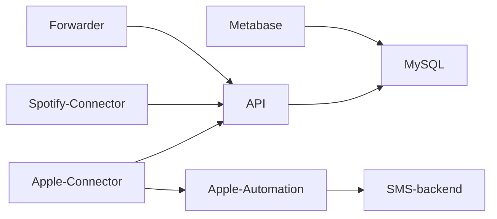

# Open Podcast Stack

This is a collection of tools and services that can be used to create a
standalone Open Podcast Analytics Stack.

It allows you to jumpstart your own analytics stack and start collecting
data about your podcast.

## Services

The following services are included in this repository:

- [API]: The API that is used to store the data in the database
- [Forwarder]: A proxy in front of your podcast host which forwards realtime RSS
  request data to the API
- [Spotify-Connector]: The connector to fetch data from Spotify
- [Apple-Connector]: The connector to fetch data from Apple
- [Apple-Automation]: The automation to fetch a session cookie from Apple
- [Metabase]: The analytics tool that is used to visualize the data
- [MySQL]: The database

Check out the individual repositories for more information.

Here is how the services are connected:



## Usage

Get started by using the [Docker Compose](https://docs.docker.com/compose/) file
in this repository.

First, you need to create a few `.env` files in the root of this repository. You
can use the `*.env.sample` files as templates. Run `make env` to create the
`.env` files automatically by copying the sample files.

Then, you can start the stack using

```bash
make up
```

This will start the entire stack except the forwarder and make it available on
your local machine.

If you want to start the forwarder as well, you can use

```bash
make up-all
```

You can start individual services using

```bash
make up-<service>
```

where `<service>` is the name of the service you want to start e.g.

```bash
make up-api
```

[api]: https://github.com/openpodcast/api
[forwarder]: https://github.com/openpodcast/forwarder
[spotify-connector]: https://github.com/openpodcast/spotify-connector
[apple-connector]: https://github.com/openpodcast/apple-connector
[metabase]: https://github.com/metabase/metabase
[mysql]: https://hub.docker.com/_/mysql
[apple-automation]: https://github.com/openpodcast/apple-automation

## Login and Testing

If you haven't changed any passwords and just started the stack, you can login
at `http://localhost:3000` with the following credentials:
User-Email: noreply@test.example
Password: OpenPodcastAdmin123 