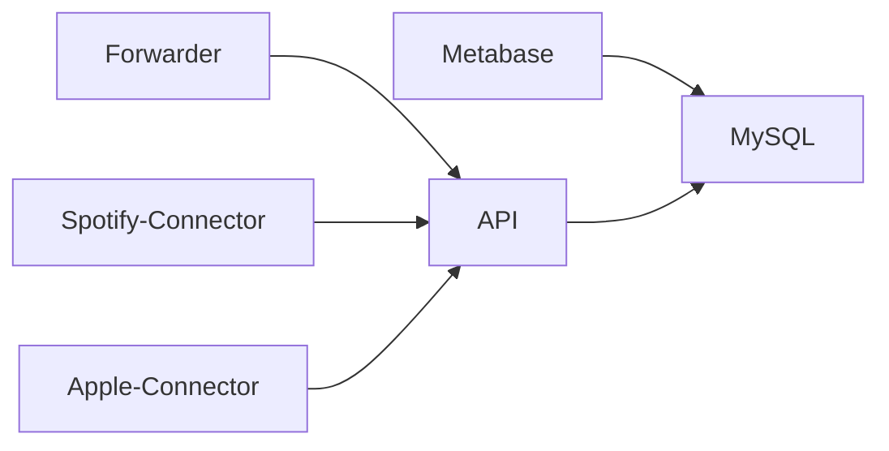

# Open Podcast Stack

This is a collection of tools and services that can be used to create a
standalone Open Podcast Analytics Stack.

## Services

The following services are included in this repository:

- **API**: The API that is used to store the data in the database
- **Forwarder**: Forwards realtime RSS request data to the API
- **Spotify-Connector**: The connector to fetch data from Spotify
- **Apple-Connector**: The connector to fetch data from Apple
- **Metabase**: The analytics tool that is used to visualize the data
- **MySQL**: The database



## Usage

Get started by using the [Docker Compose](https://docs.docker.com/compose/) file
in this repository:

```bash
make up
```

This will start the entire stack except the forwarder and make it available on your local machine.

If you want to start the forwarder as well, you can use

```bash
make up-all
```
